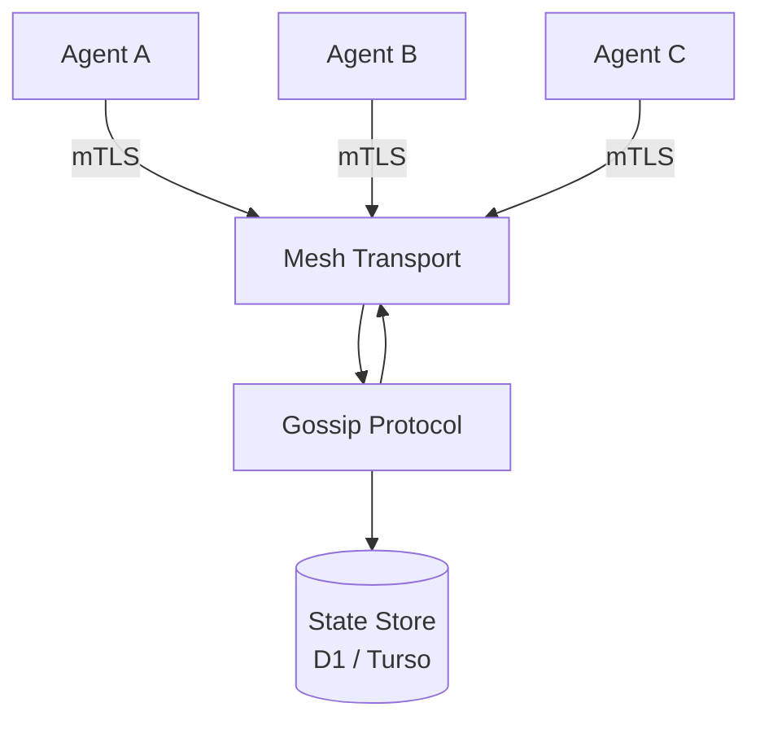

# Poke-Mesh


> Edge-native agent mesh networking for the Agentic Web

---

## Overview

Poke-Mesh is the agent-to-agent communication layer for the LoveLogicAI Agent Company OS. It provides a resilient mesh networking substrate built on gossip protocol, mutual TLS (mTLS), and Cloudflare Workers — enabling agents at the edge to discover, communicate, and coordinate without a central broker.

**Key capabilities:**
- Agent-to-agent communication over mTLS-secured transports
- Gossip protocol for decentralized state propagation and peer discovery
- Mesh topology management (star, ring, full-mesh)
- Persistent state via Cloudflare D1 or Turso (libSQL)
- Deployable to Cloudflare Workers edge network globally

Part of the **LoveLogicAI Agent Company OS**.

---

## Architecture Overview



---

## Tech Stack

| Layer | Technology |
|---|---|
| Runtime | Bun |
| HTTP Framework | Hono |
| Edge Deployment | Cloudflare Workers |
| ORM | Drizzle ORM |
| Database | Cloudflare D1 / Turso (libSQL) |
| Transport Security | mTLS |

---

## Quickstart

### 1. Clone & install

```bash
git clone https://github.com/LoveLogicAILLC/poke-mesh.git
cd poke-mesh
bun install
```

### 2. Configure environment

```bash
cp .env.example .env
# Edit .env with your values
```

### 3. Run dev server

```bash
bun run dev
```

### 4. Run tests

```bash
bun run test
```

### 5. Deploy

```bash
bun run deploy
```

---

## Environment Variables

| Variable | Default | Description |
|---|---|---|
| `NODE_ENV` | `development` | Runtime environment |
| `PORT` | `3000` | HTTP server port |
| `DATABASE_URL` | — | D1 / Turso connection string |
| `CLOUDFLARE_ACCOUNT_ID` | — | Cloudflare account ID for Workers |
| `CLOUDFLARE_API_TOKEN` | — | Cloudflare API token for deployment |
| `LOG_LEVEL` | `info` | Pino log level (debug/info/warn/error) |
| `MESH_GOSSIP_INTERVAL_MS` | `5000` | Gossip tick interval in milliseconds |
| `MESH_MAX_AGENTS` | `100` | Maximum agents in mesh |
| `MTLS_CA_PATH` | `./certs/ca.pem` | Path to mTLS Certificate Authority PEM |

See `.env.example` for the full list with descriptions.

---

## API

| Method | Path | Description |
|---|---|---|
| `GET` | `/health` | Service health check |
| `GET` | `/mesh/status` | Mesh topology and agent count |

---

## Contributing

1. Fork the repo and create a feature branch: `git checkout -b feat/my-feature`
2. Make your changes, ensuring all tests pass: `bun run test`
3. Run the linter and formatter: `bun run lint`
4. Open a pull request against `main` with a clear description

All PRs must pass CI before merging. Please follow the existing code style enforced by Biome.

---

## License

MIT © 2026 LoveLogicAI LLC — see [LICENSE](./LICENSE) for details.

---

<p align="center">Part of the <strong>LoveLogicAI Agent Company OS</strong></p>
